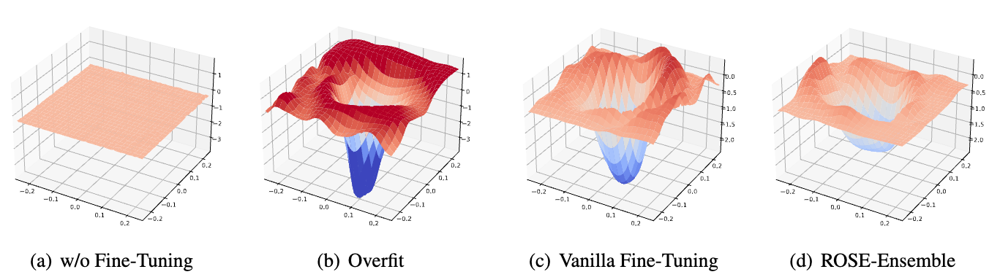

# ROSE: Robust Selective Fine-tuning for Pre-trained Language Models

This repo contains the code of our EMNLP 2022 paper, ROSE: Robust Selective Fine-tuning for Pre-trained Language Models.

## Contents

1. [Introduction](#introduction)
2. [Usage](#usage)
3. [Contacts](#contacts)
4. [Acknowledgements](#acknowledgements)

## Introduction

We present an ***attack-agnostic*** and ***model-agnostic*** defense method called **RO**bust **SE**letive fine-tuning (**ROSE**).
ROSE conducts selective updates when adapting pre-trained models to downstream tasks, filtering out invaluable and unrobust updates of parameters.
The experimental results show that ROSE achieves significant improvements in adversarial robustness on various downstream NLP tasks.
Furthermore, ROSE can be easily incorporated into existing fine-tuning methods to improve their adversarial robustness further.
ROSE eliminates unrobust spurious updates during fine-tuning, leading to solutions corresponding to flatter and wider optima than the conventional method. The following figure is an illustration of our models.

<p align="center">  </p>

## Usage

### Requirements

Install dependencies and apex:

```bash
conda create -n rose python=3.8
conda activate rose

git clone https://github.com/jiangllan/ROSE.git && cd ROSE
pip intall -r requirment.txt

git clone https://github.com/NVIDIA/apex
cd apex && pip install -v --no-cache-dir ./
```

### Training and Evaluation

Please refer to [runs](https://github.com/jiangllan/ROSE/tree/main/runs) for training and test commands.

#### Training

1. Training with ROSE-First on QNLI
```bash
#                               [model name]  [n_gpu]  [lr]   [bs] [seed] [upper_thd]  [lower_thd]  [dropout]  [task name]  
bash run_train_sparse_first.sh  roberta-base     1    0.00002  32   8910       70           0          0.1        qnli
```

For each task, we report the specific settings of several important hyper-parameters:

| Hyper-parameter | QNLI                         | QQP  | RTE  | SST-2 | QNLI                          | QQP  | RTE  | SST-2 |
| --------------- | ---------------------------- | ---- | ---- | ----- | ----------------------------- | ---- | ---- | ----- |
|                 | $\text{RoBERTa}_\text{Base}$ |      |      |       | $\text{RoBERTa}_\text{Large}$ |      |      |       |
| `--lr`          | 2e-5                         | 2e-5 | 4e-5 | 2e-5  | 3e-5                          | 2e-5 | 1e-5 | 4e-5  |
| `--upper`       | 70                           | 70   | 80   | 60    | 50                            | 70   | 80   | 70    |

2. Training with ROSE-Second on QNLI

```bash
#                                [model name]  [n_gpu]   [lr]   [bs] [seed] [upper_thd] [lower_thd]  [task name]  
bash run_train_sparse_second.sh  roberta-base     1    0.00001   32   8910       40          0          qnli
```

For each task, we report the specific settings of several important hyper-parameters:

| Hyper-parameter | QNLI                         | QQP  | RTE  | SST-2 | QNLI                          | QQP  | RTE  | SST-2 |
| --------------- | ---------------------------- | ---- | ---- | ----- | ----------------------------- | ---- | ---- | ----- |
|                 | $\text{RoBERTa}_\text{Base}$ |      |      |       | $\text{RoBERTa}_\text{Large}$ |      |      |       |
| `--lr`          | 1e-5                         | 1e-4 | 4e-5 | 1e-4  | 1e-5                          | 1e-5 | 2e-5 | 1e-5  |
| `--upper`       | 40                           | 60   | 60   | 30    | 50                            | 60   | 50   | 50    |

3. Training with ROSE-Ensemble on QNLI

```bash
#                               [model name]  [n_gpu]  [lr]   [bs] [seed] [upper_thd]  [lower_thd]  [dropout]  [task name]  [gamma]
bash run_train_sparse_first.sh  roberta-base     1    0.00001  32   8910       90           0          0.1        qnli        0.5
```

For each task, we report the specific settings of several important hyper-parameters:

| Hyper-parameter | QNLI                         | QQP  | RTE  | SST-2 | QNLI                          | QQP  | RTE  | SST-2 |
| --------------- | ---------------------------- | ---- | ---- | ----- | ----------------------------- | ---- | ---- | ----- |
|                 | $\text{RoBERTa}_\text{Base}$ |      |      |       | $\text{RoBERTa}_\text{Large}$ |      |      |       |
| `--lr`          | 1e-5                         | 5e-5 | 4e-5 | 5e-5  | 1e-5                          | 1e-5 | 1e-5 | 1e-5  |
| `--upper`       | 90                           | 75   | 80   | 40    | 30                            | 80   | 85   | 70    |

#### Evaluation

1. Evaluation on GLUE

```bash
#                     [path to checkpoint]  [task name]
bash run_test_ori.sh       ../temp/..          qnli
```

2. Evaluation  on AdvGLUE

```bash
#                     [path to checkpoint]  [task name]
bash run_test_adv.sh       ../temp/..          qnli
```

## Contacts

jiangl20 at mails dot tsinghua dot edu dot cn

## Acknowledgements

This codebase is built on [Huggingface's Transformers](https://github.com/huggingface/transformers/tree/v4.10.0). Thanks to them!
